# Detección de anomalías en transacciones GMM
# URLs de proyecto
- [Aplicaión](https://gmm-fraud-detector.streamlit.app/)


# Descripción del proyecto.
En sistemas financieros, plataformas de pago y comercio electrónico, se generan grandes volúmenes de transacciones diariamente. Dentro de este flujo masivo de datos, pueden existir transacciones fraudulentas o comportamientos inusuales que representan riesgos económicos y de seguridad.

El problema consiste en identificar automáticamente aquellas transacciones que se desvían del comportamiento normal, sin depender necesariamente de ejemplos previamente etiquetados como fraude.

Este tipo de detección es crítico en escenarios donde:

- El fraude evoluciona constantemente.
- No se cuenta con un historial completo o confiable de casos etiquetados.
- Se requiere detección en tiempo (casi) real.

## Tipo de problema.
Este problema se clasifica como:

- Clustering (agrupamiento):
    Se busca agrupar las transacciones en función de su similitud, identificando patrones de comportamiento.
- Detección de anomalías (Anomaly Detection):
    Se pretende identificar aquellos datos que no encajan bien en ningún grupo o tienen baja probabilidad dentro de la distribución aprendida.
- Aprendizaje no supervisado:
    No se utilizan etiquetas (fraude / no fraude), sino que el modelo aprende la estructura de los datos por sí mismo.

## Enfoque con Gaussian Mixture Models (GMM).
Los Gaussian Mixture Models (GMM) son modelos probabilísticos que asumen que los datos provienen de una combinación de múltiples distribuciones gaussianas.

Idea clave:
Cada grupo de comportamiento "normal" se modela como una distribución gaussiana.
Una transacción será considerada anómala si tiene baja probabilidad de pertenecer a cualquier componente del modelo.

Funcionamiento general:
- Se entrena el modelo GMM sobre los datos históricos.
- El modelo identifica diferentes patrones (clusters).
- Para cada nueva transacción, se calcula su probabilidad de pertenencia.
- Si la probabilidad es muy baja → se marca como anomalía. 

## Seleccion del dataset.
Se hizo la seleccion del dataset en la plataforma de Kaggle ya en esta se encuentran datasets que ya estan listos para usar y que su vez son muy usados en investigacion.

### Ventajas.
- Datos limpios
- Comunidad activa
- Notebooks con ejemplos
- Acceso gratuito
- Portafolios prefesional

### Desventajas.
- Falta de contexto real
- Datos sintéticos o simulados
- Problemas de calidad
- Sobreajuste a benchmarks

Se seleccionó el dataset “Credit Card Fraud” disponible en Kaggle, publicado por Incribo. El conjunto de datos contiene aproximadamente 8,000 registros y cerca de 20 variables relacionadas con transacciones financieras, orientadas al análisis y detección de fraude en tarjetas de crédito.

## ¿Porque este dataset?
La elección de este dataset se realizó debido a que presenta características adecuadas para el desarrollo de un modelo de detección de anomalías mediante Gaussian Mixture Models (GMM) en un entorno de aprendizaje no supervisado.

Las razones fueron las siguientes:
1. Relación directa con el problema de investigación
2. Adecuado para aprendizaje no supervisado
3. Variables útiles para modelado estadístico

## Definicion de variables
 La aplicación web utilizará features relacionados con el comportamiento financiero del usuario y las características de la transacción.

 1. Monto de la transacción
    Representa el valor monetario de la transacción realizada.

    Tipo de dato: Float

    Importancia: El monto es uno de los indicadores más importantes en detección de fraude, ya que las transacciones fraudulentas suelen presentar:
    - Valores inusualmente altos.
    - Compras fuera del patrón habitual.
    - Cambios bruscos en el comportamiento financiero.

2. Hora de la transacción
    Corresponde a la hora exacta en que se realiza la transacción.

    Tipo de dato: Integer

    Importancia: Los usuarios suelen tener patrones horarios repetitivos, las transacciones realizadas en horarios inusuales pueden indicar fraude.

3. Ubicación
    Representa la ubicación geográfica desde donde se realiza la transacción.

    Tipo de dato: String

    Importancia: Permite identificar
    - Cambios inesperados de ubicación.
    - Compras en regiones no habituales.
    - Accesos sospechosos.

4. Tipo de comercio
    Categoría del establecimiento donde se realiza la compra.

    Tipo de dato: String

    Importancia: Los usuarios suelen comprar en categorías similares. Cambios repentinos pueden representar comportamiento anómalo.

5. Método de pago
    Indica el medio utilizado para realizar la transacción:

    - Crédito.
    - Débito.
    - Transferencia.
    - Billetera digital.

    Tipo de dato: String

    Importancia: Cambios inesperados en el método de pago pueden indicar actividad sospechosa.

6. Dispositivo utilizado
    Tipo de dispositivo desde el cual se realiza la operación:

    - Móvil,
    - Computador,
    - Tablet.

    Tipo de dato: String

    Importancia: Permite detectar
    - Accesos desde dispositivos no habituales.
    - Cambios inesperados de comportamiento.
---
# Descripción del modelo Gaussian Mixture Model (GMM)

Este componente del proyecto documenta el flujo de trabajo integral para la detección de fraudes financieros mediante gaussian mixture models (gmm). El desarrollo abarca desde la preparación del entorno de trabajo hasta la generación de los artefactos del modelo para producción.

---

## Configuración del espacio de trabajo

Para asegurar la reproducibilidad del proyecto, se siguieron estos pasos de configuración inicial.

### Clonación del repositorio

Obtención del código fuente y estructura base:

```bash
git clone https://github.com/JUANPIS008/Deteccion-de-Anomalias-en-transacciones---GMM
cd Deteccion-de-Anomalias-en-transacciones---GMM
```

#### Evidencia

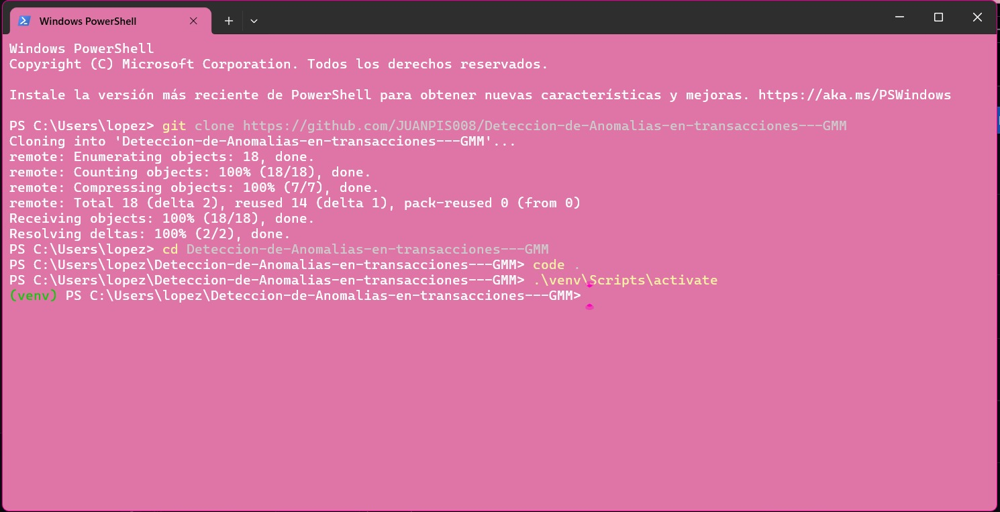

### Activación del entorno virtual (venv)

Aislamiento de dependencias para evitar conflictos de sistema:

```bash
python -m venv venv
.\venv\Scripts\activate
```

#### Evidencia

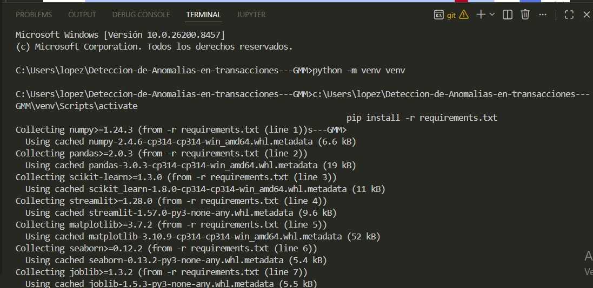

### Instalación de requerimientos

Instalación de las librerías necesarias definidas en `requirements.txt` (pandas, scikit-learn, joblib, entre otras):

```bash
pip install -r requirements.txt
```

#### Evidencia

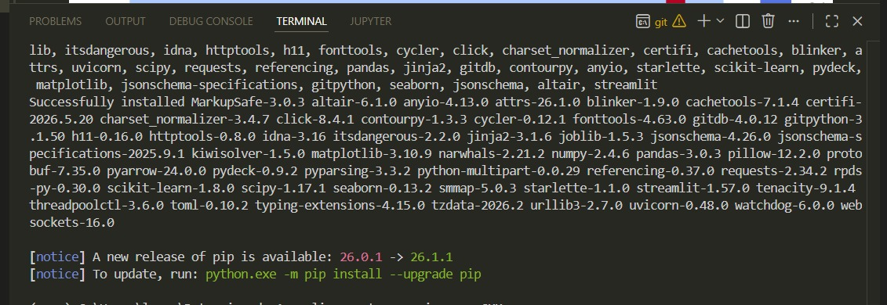

---

## Tareas de análisis y modelado realizadas

Según el backlog de actividades, se completaron satisfactoriamente las siguientes tareas.

### Tarea #4: Exploración de datos (eda)

Se analizó el dataset `credit_card_fraud.csv`, compuesto por 8.000 registros.

#### Visualización

Se implementaron boxplots con escala logarítmica para identificar la distribución de montos en transacciones normales frente a sospechosas.

#### Correlación

Se generó una matriz de correlación para entender la interdependencia de las 20 variables originales.

---

### Tarea #5: Preprocesamiento

#### Limpieza

Se detectaron y eliminaron 6.053 registros con valores nulos, garantizando la integridad de los datos para el modelo.

#### Estandarización

Se utilizó `StandardScaler` para normalizar las columnas `Amount` y `Time`, logrando una media de 0.00 y una desviación estándar de 1.00.

---

### Tarea #6: División de datos

Se realizó una partición estratificada del dataset para mantener el balance de las etiquetas de fraude.

| Conjunto | Registros |
|-----------|-----------:|
| Entrenamiento | 2.391 |
| Prueba | 598 |

---

### Tarea #7: Entrenamiento del modelo

Se implementó un modelo gaussian mixture model (gmm) con 2 componentes, entrenado exclusivamente con transacciones normales para modelar el comportamiento legítimo.

#### Resultado

- Convergencia exitosa.
- Log-likelihood promedio: **-15.0257**.

---

### Tarea #8: Evaluación del modelo

Se validó la calidad del agrupamiento mediante el índice silhouette.

| Métrica | Resultado |
|----------|-----------:|
| Silhouette score | 0.5085 |

El resultado fue clasificado como aceptable al superar el umbral mínimo de 0.4 exigido.

---

### Tarea #9: Detección de anomalías

Se estableció un umbral estadístico basado en el percentil 5 de las puntuaciones de densidad logarítmica.

| Parámetro | Valor |
|------------|--------:|
| Umbral calculado | -16.4611 |

#### Métricas de clasificación

| Métrica | Valor |
|----------|--------:|
| Recall (transacciones normales) | 0.96 |
| Precisión (fraudes) | 0.57 |

---

### Tarea #10: Serialización del modelo

Se persistieron los objetos finales en la carpeta `models/` para su uso en la aplicación web.

| Archivo | Descripción |
|----------|-------------|
| scaler.pkl | Escalador estandarizado (0.88 kb) |
| modelo_gmm.pkl | Modelo gmm entrenado (2.16 kb) |

---

### Tarea #18: Documentación (readme.md)

Generación de este documento técnico que detalla el ciclo de vida del entrenamiento y los resultados obtenidos.

---

## Estructura del proyecto (área técnica)

```text
data/
└── raw/

imagenes/
├── Activar_venv.jpeg
├── Clonar_repositorio.jpeg
└── Instalar_requerimientos.jpeg

notebooks/
└── 01_training.ipynb

models/
├── scaler.pkl
└── modelo_gmm.pkl

requirements.txt
```

### Descripción de directorios

- `data/raw/`: datos originales utilizados para el análisis y entrenamiento.
- `imagenes/`: evidencias del proceso de configuración del entorno.
- `notebooks/01_training.ipynb`: proceso de entrenamiento documentado paso a paso.
- `models/`: artefactos serializados del modelo en formato `.pkl`.
- `requirements.txt`: lista de dependencias necesarias para ejecutar el proyecto.

---

## Resultado final

Se desarrolló un sistema de detección de anomalías basado en gaussian mixture models (gmm), capaz de identificar patrones atípicos en transacciones financieras mediante modelado probabilístico. El modelo fue entrenado, evaluado y serializado exitosamente, quedando listo para su integración en una aplicación web orientada a la detección de posibles fraudes.
---
# Descripcion del framework Streamlit
Fue construida con **Streamlit**, un framework de Python orientado al desarrollo rapido de interfaces de datos e inteligencia artificial. Su proposito principal es permitir que cualquier persona, sin necesidad de conocimientos tecnicos avanzados, pueda analizar transacciones financieras y determinar si su comportamiento es normal o potencialmente fraudulento.

El sistema esta fundamentado en un modelo de **Mezcla de Gaussianas (Gaussian Mixture Model — GMM)**, una tecnica de aprendizaje automatico no supervisado que aprende la distribucion estadistica del comportamiento normal de las transacciones. Cuando se presenta una nueva transaccion, el modelo calcula que tan probable es que pertenezca a esa distribucion aprendida. Si la probabilidad es muy baja, la transaccion se considera anomala.

Lo que hace a este enfoque particularmente valioso en el contexto financiero es que **no requiere haber visto ejemplos de fraude para funcionar**. En la practica, el fraude es infrecuente y evoluciona constantemente, lo que dificulta la recoleccion de datos etiquetados. El GMM resuelve esto aprendiendo exclusivamente del comportamiento legitimo y detectando cualquier desviacion significativa de ese patron.

La aplicacion esta dividida en tres paginas independientes que se comunican a traves del sistema de navegacion de Streamlit: una pagina de inicio con el contexto del proyecto, una pagina de exploracion del dataset y una pagina de prediccion individual.


## Estructura del framework Streamlit
```
proyecto/
├── .venv/                  # Entorno virtual de Python
│   ├── etc/
│   ├── Lib/
│   ├── Scripts/
│   └── share/
│
├── app/                    # Codigo fuente de la aplicacion
│   ├── navegation.py       # Punto de entrada y navegacion entre paginas
│   ├── principal.py        # Pagina de inicio — contexto del sistema
│   ├── datos.py            # Pagina de exploracion del dataset
│   └── prediccion.py       # Pagina del detector de fraude
```

## Descripcion de cada archivo
| Archivo | Tipo | Responsabilidad |
|---|---|---|
| `navegation.py` | Punto de entrada | Define la estructura de navegacion y lanza la app |
| `principal.py` | Pagina | Presenta el sistema, el problema y las metricas del modelo |
| `datos.py` | Pagina | Carga y visualiza el dataset con graficos interactivos |
| `prediccion.py` | Pagina | Formulario de prediccion individual y display de resultados |
| `modelo_gmm.pkl` | Artefacto ML | Modelo GMM serializado con `joblib` |
| `scaler.pkl` | Artefacto ML | `StandardScaler` ajustado sobre `Amount` y `Time` |

## Tecnologias y Dependencias
**Streamlit** es un framework de codigo abierto para Python que convierte scripts en aplicaciones web interactivas sin necesidad de escribir HTML, CSS o JavaScript. Cada vez que el usuario interactua con un elemento de la interfaz, Streamlit re-ejecuta el script completo desde arriba hacia abajo, actualizando unicamente los componentes afectados. Esta caracteristica, conocida como modelo de ejecucion reactiva, simplifica enormemente el desarrollo pero requiere tener en cuenta el orden en que se definen los elementos.

### Dependencias del proyecto
```
streamlit       — Framework de la interfaz web
scikit-learn    — GaussianMixture, StandardScaler, metricas de evaluacion
joblib          — Serializacion y deserializacion de modelos (.pkl)
pandas          — Manipulacion de DataFrames y procesamiento de datos
numpy           — Operaciones numericas, percentiles y arrays
matplotlib      — Graficos estaticos en la pagina de datos
seaborn         — Graficos estadisticos con mejor estetica
```
### Instalacion
```bash
pip install streamlit scikit-learn joblib pandas numpy matplotlib seaborn
```

O usando el archivo de dependencias:

```bash
pip install -r requirements.txt
```

## 4. Navegacion entre Paginas — `navegation.py`

```python
import streamlit as st
 
pages = {
    "Análisis": [
        st.Page("prediccion.py", title="Detector de Fraude"),
    ],

    "Información": [
        st.Page("principal.py", title="Información del Proyecto"),
        st.Page("datos.py", title="Exploración de Datos"),
    ],
    
}
 
pg = st.navigation(pages)
pg.run()
```
### Como funciona
`navegation.py` es el unico archivo que se ejecuta directamente. Usa la API `st.navigation` de Streamlit (disponible desde la version 1.36) para definir la estructura de paginas y el menu lateral de navegacion.

Las paginas se organizan en dos secciones:

- **Analisis** Contiene la pagina principal donde se tendra el formulario para la prediccion
- **Informacion** contiene la pagina de principa;, que actua como portada del proyecto, al igual contiene la pagina de datos donde se mostrara caracteristicas del entrenamiento.


Cuando el usuario selecciona una pagina desde el menu, Streamlit ejecuta el archivo `.py` correspondiente en el mismo contexto de sesion, preservando el estado de los modelos cargados en cache.

### Como ejecutar la aplicacion
Siempre se debe apuntar a `navegation.py`, nunca a las paginas individuales:

```bash
cd app
streamlit run navegation.py
```
## 5. Pagina de Inicio — `principal.py`

### Proposito
Esta pagina actua como portada del sistema. Su objetivo no es funcional sino informativo: presenta al usuario el problema que el sistema resuelve, el enfoque tecnico adoptado y el estado actual del modelo, permitiendo que cualquier persona comprenda el contexto antes de usar el detector.

### Componentes de la pagina

#### Seccion hero
Muestra el titulo del sistema, una descripcion breve del enfoque GMM y el tipo de problema que aborda. Usa HTML personalizado inyectado con `st.markdown(..., unsafe_allow_html=True)` para lograr el diseno de tipografia monoespaciada caracteristico de la aplicacion.

#### Estadisticas del dataset
Cuatro tarjetas dispuestas en columnas con `st.columns(4)` muestran:

| Indicador | Valor |
|---|---|
| Registros totales | 8,000 |
| Transacciones normales | 4,011 |
| Transacciones fraude | 3,989 |
| Variables del modelo | 4 |

#### El Problema y La Solucion
Dos columnas paralelas explican:

- **El problema:** el desbalance de clases en fraude real, el costo asimetrico de los errores (falso negativo vs falso positivo) y la evolucion constante de los patrones de fraude.
- **La solucion GMM:** aprendizaje no supervisado, deteccion por densidad de probabilidad y umbral configurable.

#### Pipeline del sistema
Cinco tarjetas en columna que describen el flujo tecnico de procesamiento: ingesta de datos, escalado, calculo del score, comparacion con umbral y clasificacion final.

#### Estado del modelo en produccion
Una tabla de metricas reales del modelo con su interpretacion narrativa:

| Metrica | Valor | Interpretacion |
|---|---|---|
| Accuracy | 50% | Limitado por la naturaleza sintetica del dataset |
| Precision (Fraude) | 57% | De cada 100 alertas, 57 son fraudes reales |
| Recall (Fraude) | 96% | Detecta 96 de cada 100 fraudes reales |
| F1-Score (Fraude) | 0.71 | Balance entre precision y recall |

Se explica por que el **recall del 96% es la metrica critica** en seguridad financiera: es preferible generar mas alertas de revision que dejar pasar transacciones fraudulentas sin detectar.

---

## 6. Pagina de Exploracion de Datos — `datos.py`

### Proposito
Esta pagina permite al usuario explorar visualmente el dataset con el que fue entrenado el modelo. Tiene una funcion principalmente educativa y analitica: muestra la distribucion de las variables, el nivel de desbalance entre clases y la correlacion entre atributos, permitiendo comprender por que el modelo tiene las limitaciones que tiene.

### Carga de datos

```python
@st.cache_data
def cargar_datos():
    url = 'https://github.com/JUANPIS008/datasets/blob/main/credit_card_fraud.csv?raw=true'
    return pd.read_csv(url)
```

La funcion usa el decorador `@st.cache_data`, que almacena en cache el resultado de la primera carga. En ejecuciones posteriores, Streamlit retorna el DataFrame desde memoria sin volver a descargar el archivo. Esto es especialmente importante en produccion para no realizar peticiones HTTP en cada interaccion del usuario.

### Estadisticas generales
Cinco tarjetas en columnas muestran: registros totales, transacciones normales, transacciones fraude, monto promedio y monto maximo del dataset.

### Graficos incluidos
Todos los graficos usan una paleta de colores consistente con el tema oscuro de la aplicacion: azul `#58a6ff` para transacciones normales y naranja `#f0883e` para fraude. Cada grafico incluye una caja de interpretacion debajo que explica en lenguaje accesible lo que se observa.

#### Distribucion por clase
Grafico de barras que muestra el conteo absoluto de transacciones normales versus fraudulentas. Evidencia el balance casi perfecto (50/50) del dataset sintetico, lo cual es inusual en fraude real.

#### Distribucion del monto por clase
Histograma superpuesto que muestra como se distribuye el monto de la transaccion en ambas clases. La superposicion casi perfecta de las distribuciones confirma que el monto por si solo no tiene poder discriminativo en este dataset.

#### Fraude por tipo de tarjeta, canal y dispositivo
Tres graficos de barras agrupadas que analizan si alguna categoria (tipo de tarjeta, canal online/presencial, dispositivo movil/escritorio) muestra una tasa de fraude significativamente distinta. En el dataset sintetico, ninguna categoria presenta diferencias estadisticas relevantes.

#### Matriz de correlacion
Mapa de calor generado con Seaborn que muestra las correlaciones lineales entre todas las variables numericas del dataset, incluyendo la etiqueta de fraude. Las correlaciones cercanas a cero en todas las variables confirman la naturaleza sintetica y aleatoria del dataset.

#### Muestra del dataset
Una tabla interactiva con los primeros 100 registros del dataset, mostrando las columnas mas relevantes para el analisis.


## 7. Pagina del Detector de Fraude — `prediccion.py`

### Proposito
Esta es la pagina principal funcional del sistema. Permite al usuario ingresar los datos de una transaccion financiera y obtener en tiempo real una clasificacion del modelo GMM, junto con el log-score de densidad, el nivel de riesgo y una explicacion del resultado.

A su vez muestra como se usa el formulario y como diligenciarlo, asi mismo contiene el origen de los datos y la limitacion del modelo.

### Estructura de la pagina

```
prediccion.py
├── Configuracion de pagina
├── Estilos CSS personalizados
├── Carga de modelos (con cache)
├── Sidebar — configuracion del umbral
├── Header — titulo y descripcion
├── Expander 1 — informacion del dataset
├── Expander 2 — manual de usuario
├── Formulario de prediccion
│   ├── Monto de la transaccion
│   ├── Merchant Category Code (MCC)
│   ├── Fecha de la transaccion
│   ├── Hora de la transaccion
│   └── Codigo de respuesta del procesador
├── Bloque de prediccion (se activa al enviar el formulario)
│   ├── Metricas: log-score, umbral, nivel de riesgo
│   ├── Barra de riesgo visual
│   ├── Tarjeta de resultado (fraude / normal)
│   ├── Expander — vector enviado al modelo
│   └── Nota tecnica
└── Footer
```

### Carga de modelos

```python
@st.cache_resource
def cargar_modelos():
    modelo = joblib.load("models/modelo_gmm.pkl")
    scaler = joblib.load("models/scaler.pkl")
    return modelo, scaler
```

Se usa `@st.cache_resource` (en lugar de `@st.cache_data`) porque los modelos son objetos de Python que no deben ser copiados entre sesiones sino compartidos. El decorador garantiza que `joblib.load` se ejecuta una sola vez por sesion, independientemente de cuantas veces el usuario interactue con la pagina.

Las columnas exactas con las que fue entrenado el modelo se recuperan automaticamente:

```python
FEATURE_COLS = list(gmm_model.feature_names_in_)
# ['Time', 'Amount', 'Merchant Category Code (MCC)', 'Transaction Response Code']
```

Esto evita errores de orden o nombre de columnas al construir el vector de entrada.

### Panel lateral (Sidebar)
El sidebar contiene el control de configuracion del umbral de deteccion mediante `st.sidebar.number_input`. Permite ajustar el valor entre -100.0 y 0.0 con pasos de 0.01. El valor por defecto es `-16.46`, correspondiente al percentil 5% calibrado con el set de prueba.

Tambien muestra las columnas exactas que el modelo espera recibir, mostradas con `st.sidebar.code` para distinguirlas visualmente.

### Expander — Informacion del dataset
Seccion colapsable que informa al usuario sobre el origen de los datos, la composicion del dataset, las variables utilizadas y las limitaciones conocidas del modelo. Esta informacion es relevante para que el usuario interprete correctamente los resultados de la prediccion.

### Expander — Manual de usuario
Siete pasos en lenguaje accesible que explican como completar cada campo del formulario correctamente. Incluye ejemplos de valores validos e invalidos, codigos MCC comunes y sus categorias, descripcion de los codigos de respuesta del procesador, e interpretacion de cada uno de los indicadores del resultado.

### Formulario de prediccion
Implementado con `st.form`, lo que significa que **ninguna prediccion se ejecuta hasta que el usuario presiona el boton "Analizar Transaccion"**. Esto es importante porque evita que el modelo se llame multiples veces mientras el usuario esta completando los campos.

#### Campos del formulario

| Campo | Tipo de componente | Variable del modelo |
|---|---|---|
| Monto de la transaccion | `st.number_input` | `Amount` (se escala) |
| Merchant Category Code | `st.selectbox` | `Merchant Category Code (MCC)` |
| Fecha de la transaccion | `st.date_input` | Parte de `Time` (se convierte y escala) |
| Hora de la transaccion | `st.time_input` | Parte de `Time` (se convierte y escala) |
| Codigo de respuesta | `st.selectbox` | `Transaction Response Code` |

La fecha y la hora se ingresan como campos separados para mayor claridad, pero internamente se combinan en un unico valor `datetime` antes de la prediccion.

---

## 8. Flujo de Prediccion Paso a Paso
Cuando el usuario presiona "Analizar Transaccion", se ejecuta el siguiente pipeline interno:

### Paso 1 — Conversion de fecha y hora a timestamp Unix

```python
transaction_datetime = datetime.combine(fecha, hora)
timestamp = int(pd.Timestamp(transaction_datetime).timestamp())
```

La fecha y hora seleccionadas en el formulario se combinan en un objeto `datetime` y luego se convierten a un numero entero que representa los segundos transcurridos desde el 1 de enero de 1970 (epoch Unix). Este formato numerico es equivalente al que se usaba en el dataset de entrenamiento.

### Paso 2 — Escalado de Amount y Time

```python
datos_escalar = pd.DataFrame([{
    "Amount": transaction_amount,
    "Time":   timestamp
}])[escalador.feature_names_in_]

scaled_values = escalador.transform(datos_escalar)
```

El `StandardScaler` cargado desde `scaler.pkl` aplica la transformacion: resta la media y divide por la desviacion estandar calculadas durante el entrenamiento. Es critico que los datos nuevos se escalen con el mismo escalador, de lo contrario los valores quedarian en una escala distinta a la que el modelo conoce y los scores resultarian erroneos.

El escalador solo procesa `Amount` y `Time`. Los campos `MCC` y `Transaction Response Code` se usan en su escala original porque el modelo fue entrenado asi.

### Paso 3 — Construccion del vector de entrada

```python
X_input = pd.DataFrame([{
    "Time":                          time_scaled,
    "Amount":                        amount_scaled,
    "Merchant Category Code (MCC)":  mcc,
    "Transaction Response Code":     response_code,
}])[FEATURE_COLS]
```

Se construye un DataFrame con exactamente las cuatro columnas que el modelo espera, en el orden exacto extraido de `gmm_model.feature_names_in_`. El reordenamiento explicito con `[FEATURE_COLS]` al final protege contra errores de orden que podrian producir predicciones incorrectas silenciosamente.

### Paso 4 — Calculo del log-score

```python
log_score = gmm_model.score_samples(X_input)[0]
```

`score_samples` devuelve el logaritmo de la densidad de probabilidad de cada muestra bajo el modelo GMM. El resultado es un numero negativo: cuanto mas cercano a cero, mayor es la probabilidad de que la transaccion pertenezca a la distribucion normal aprendida. Cuanto mas negativo, mas anomala es la transaccion.

### Paso 5 — Determinacion del nivel de riesgo

```python
if log_score < -25:
    riesgo = "ALTO"
elif log_score < umbral_manual:
    riesgo = "MEDIO"
else:
    riesgo = "BAJO"
```

El nivel de riesgo se determina en dos etapas. Un score inferior a -25 indica una anomalia severa y se clasifica directamente como riesgo ALTO. Un score entre -25 y el umbral configurado indica riesgo MEDIO. Un score por encima del umbral indica riesgo BAJO.

### Paso 6 — Clasificacion final

```python
if log_score < umbral_manual:
    # FRAUDE DETECTADO
else:
    # TRANSACCION NORMAL
```

La clasificacion binaria final (fraude / normal) se determina comparando el log-score con el umbral configurado en el sidebar. Si el score cae por debajo del umbral, la transaccion se clasifica como anomala independientemente del nivel de riesgo.

---

## 9. Configuracion del Umbral

El umbral es el parametro mas importante del sistema y el unico que puede modificarse desde la interfaz sin necesidad de reentrenar el modelo.

### Que es el umbral

Es un valor de log-score que define la frontera entre lo que el sistema considera normal y lo que considera fraude. Toda transaccion con un score inferior al umbral se clasifica como potencialmente fraudulenta.

### Como se calculo el valor por defecto

Durante el entrenamiento se calcularon los log-scores de todas las transacciones del set de prueba. El umbral por defecto corresponde al **percentil 5%** de esa distribucion, lo que significa que el 5% de las transacciones con peores scores son clasificadas como fraude.

```python
threshold_limite = np.percentile(log_scores, 5)
```

### Como interpretarlo

| Umbral | Efecto en el detector |
|---|---|
| `-16.88` | Conservador: solo marca las anomalias mas evidentes, menos falsas alarmas |
| `-16.46` | Equilibrado: configuracion recomendada, percentil 5% calibrado |
| `-16.10` | Agresivo: detecta mas transacciones como fraude, mas falsos positivos |

### Cuando ajustarlo

Se recomienda bajar el umbral (hacerlo mas negativo) cuando el sistema genera demasiadas alertas sobre transacciones que en realidad son normales. Se recomienda subirlo cuando se detectan fraudes reales que el sistema no esta marcando como tales.

---

## 10. Diseno Visual y Estilos

La aplicacion usa un sistema de diseno consistente basado en tres decisiones esteticas centrales.

### Tema oscuro

El fondo principal es `#0b0f19`, un azul marino muy oscuro que evoca interfaces de monitoreo y seguridad. El texto principal usa `#c9d1d9` (gris claro) y los titulos usan `#e6edf3` (casi blanco) para crear jerarquia sin recurrir al blanco puro.

### Tipografia dual

Se combinan dos familias de Google Fonts con propositos distintos:

- **IBM Plex Mono** para titulos, etiquetas, codigos y numeros. Su caracter monoespaciado refuerza la naturaleza tecnica del sistema.
- **IBM Plex Sans** para cuerpos de texto y descripciones. Su trazado limpio garantiza legibilidad en bloques de texto extendido.

### Sistema de color semantico

Los colores comunican significado sin necesidad de texto adicional:

| Color | Hex | Uso |
|---|---|---|
| Azul acento | `#58a6ff` | Titulos de seccion, etiquetas, elementos interactivos |
| Naranja alerta | `#f0883e` | Alertas de fraude, advertencias, metricas preocupantes |
| Verde normal | `#3fb950` | Transacciones normales, metricas positivas |
| Amarillo medio | `#d29922` | Riesgo medio, advertencias menores |
| Gris texto | `#8b949e` | Texto secundario, descripciones |
| Gris sutil | `#6e7681` | Subtitulos, captions |

### Inyeccion de CSS personalizado

Streamlit permite inyectar CSS personalizado a traves de:

```python
st.markdown("""<style>...</style>""", unsafe_allow_html=True)
```

Este bloque se coloca al inicio de cada pagina y define todas las clases de componentes visuales: tarjetas, titulos de seccion, contenedores de resultado, badges de riesgo y el footer. Al estar definido al inicio de la ejecucion, los estilos estan disponibles para todos los elementos HTML que se rendericen posteriormente en la misma pagina.

---

## 11. Como Ejecutar la Aplicacion

### Requisitos previos
- Python 3.9 o superior
- Los archivos `modelo_gmm.pkl` y `scaler.pkl` deben estar en la carpeta `models/` relativa al directorio `app/`

### Pasos

```bash
# 1. Clonar o descargar el proyecto
cd Deteccion-de-Anomalias-en-transacciones---GMM

# 2. Activar el entorno virtual (Windows)
.venv\Scripts\activate

# 3. Activar el entorno virtual (Mac/Linux)
source .venv/bin/activate

# 4. Instalar dependencias
pip install streamlit scikit-learn joblib pandas numpy matplotlib seaborn

# 5. Ejecutar la aplicacion
cd app
streamlit run navegation.py
```

La aplicacion se abre automaticamente en el navegador en `http://localhost:8501`.

### Estructura de carpetas necesaria para que funcione

```
app/
├── navegation.py
├── principal.py
├── datos.py
├── prediccion.py
└── models/           
    ├── modelo_gmm.pkl
    └── scaler.pkl
```

---

## 12. Errores Frecuentes y Soluciones

### `ModuleNotFoundError: No module named 'joblib'`

```bash
pip install joblib
```

### `ModuleNotFoundError: No module named 'sklearn'`

```bash
pip install scikit-learn
```

Scikit-learn es necesario no solo para el entrenamiento sino tambien para deserializar el modelo. Cuando `joblib` carga un `.pkl` que contiene un objeto de sklearn, necesita que la libreria este instalada en el entorno actual.

### `FileNotFoundError: models/modelo_gmm.pkl`

La aplicacion busca los modelos en una ruta relativa desde el directorio donde se ejecuta. Asegurarse de ejecutar `streamlit run navegation.py` desde dentro de la carpeta `app/` y de que la subcarpeta `models/` existe en ese mismo nivel.

### Log-score con valores extremos (ejemplo: -125,000,000)

Indica que el escalador esta recibiendo datos en un rango muy distinto al que vio durante el entrenamiento. La causa mas frecuente es un timestamp fuera del rango del dataset original. Verificar que la conversion de fecha a timestamp Unix se realiza correctamente y que las fechas ingresadas corresponden al periodo del dataset.

### `Feature names unseen at fit time`

El modelo recibe columnas con nombres distintos a los que tuvo durante el entrenamiento. Verificar que los nombres de las columnas en `X_input` coinciden exactamente con `gmm_model.feature_names_in_`, incluyendo mayusculas, espacios y parentesis.

## Demostracion del funcionamiento de la pagina web

### 1. Pagina de la prediccion de transacciones con anomalias
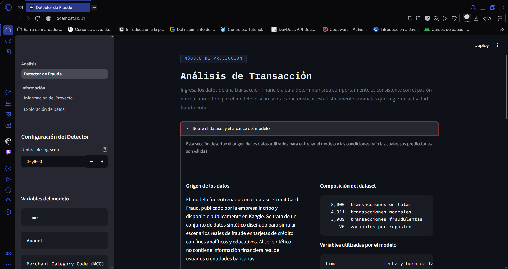
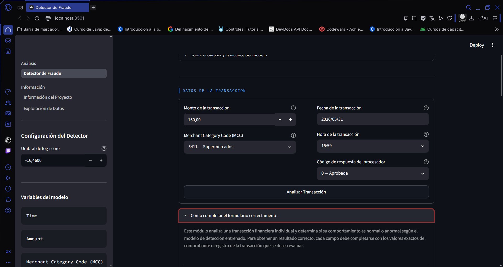
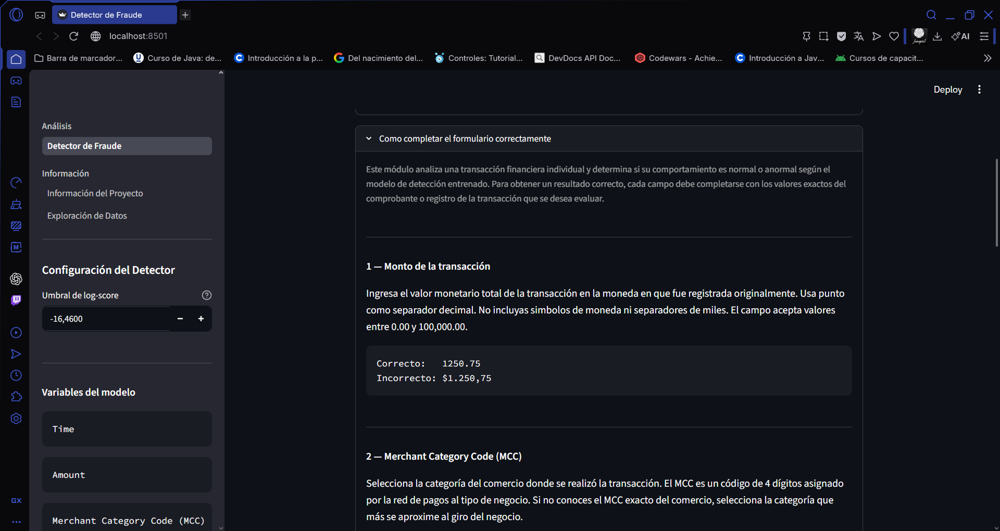

### 2. Pagina de la informaticas acerca del problema y solucion
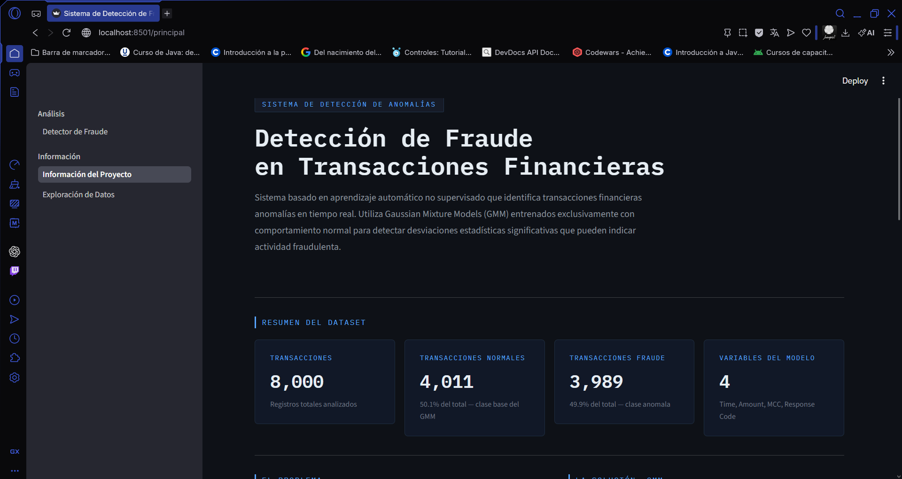
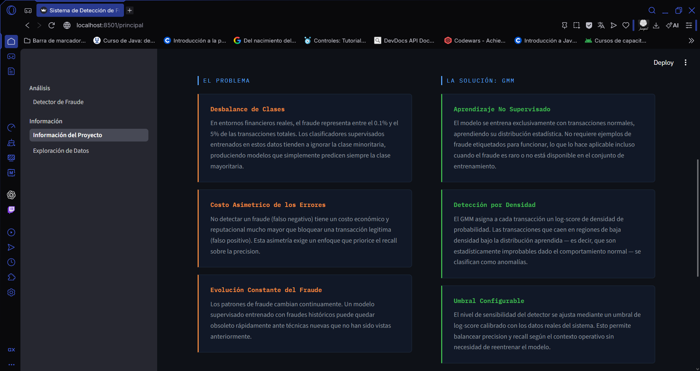
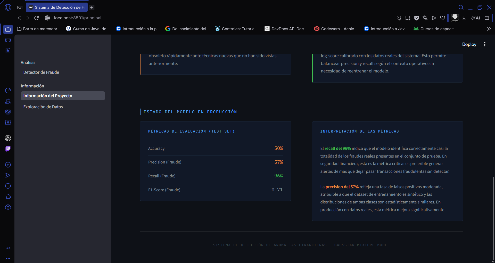

### 3. Exploracion del dataset seleccionado
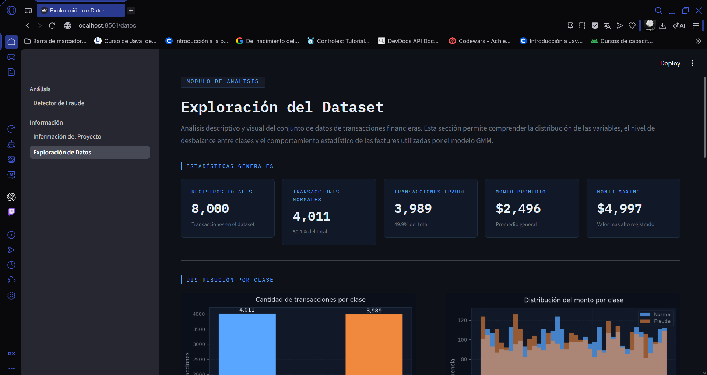
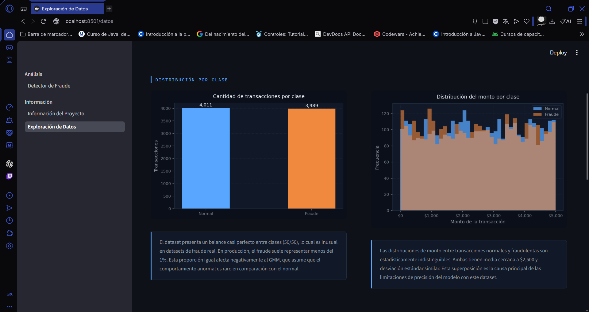
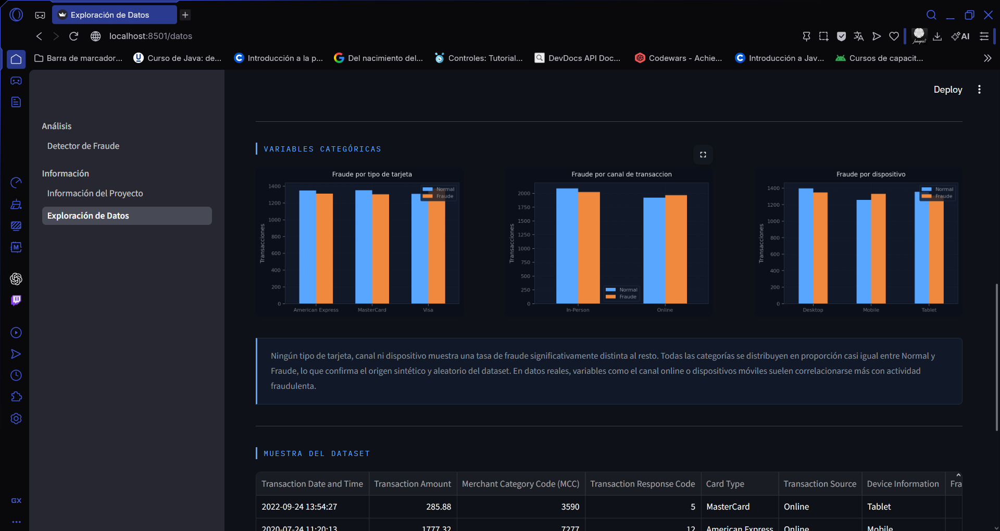
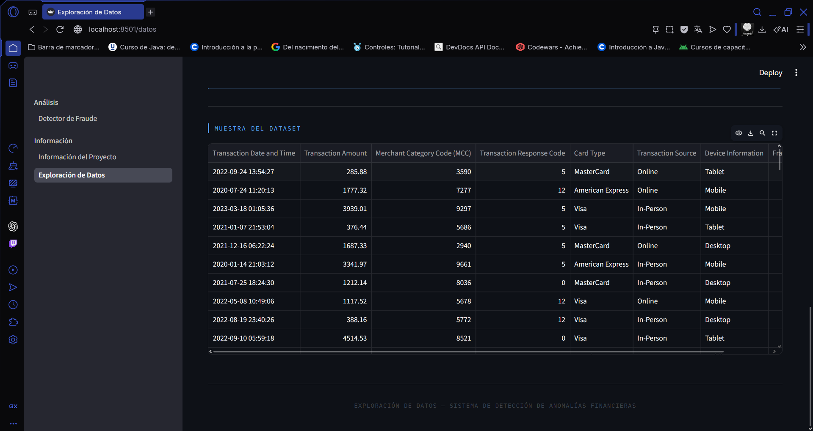

### 4. Funcionamiento de la prediccion
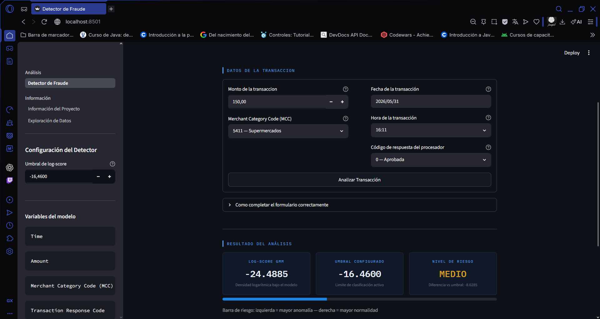

--- 
# Guía de despliegue-Detección de anomalías en transacciones GMM.

## Plataforma seleccionada: Stream Cloud
Esta plataforma fué seleccionada por ser gratuito, no requiere de enlaces de tarjetas y tiene integración con aplicaciones Streamlit y repositorios de GitHub. No requiere archivos de configuración adicionales como `Procfile` o `Dockerfile`.
### Requistios previos 
Antes de continuar con el despliegue, se debe tener presente:
- Cuenta activa en GitHub.
- Cuenta activa en StreamCloud - se logra enlazar con la cuenta de GitHub.
- Repositorio público.
- Notebook `01_training.ipynb` ejecutando para garantizar la generación de archivos pertenencientes al modelo.
Verificación de que el repositorio tenga la estructura propuesta por la guía propuesta por el profesor:
```
Detección de anomalías en transacciones GMM/
├── requirements.txt        ← obligatorio para que Streamlit instale dependencias
├── app/
│   └── navegation.py             ← archivo principal de la aplicación
└── models/
    ├── modelo_gmm.pkl        ← generado al ejecutar el notebook
    ├── scaler.pkl           ← generado al ejecutar el notebook
```
## Conectar el repositorio a Streamlit Cloud
- Se ingresa a [streamlit.io](https://streamlit.io/cloud).
- Se inicia sesión en la plataforma, lo enlazamos con GitHub y el repositorio.
- Se procede a crear la nueva app en la platforma.
- Se llena el requerido formulario por la plataforma.


| Comando | Descripción |
|---|---|
| `Respositorio` | JUANPIS008/Deteccion-de-Anomalias-en-transacciones---GMM |
| `Branch` | main |
| `Main File Path` | app/navegation.py |
| `App URL (opcinal)` | gmm-fraud-detector |


Se cerciora que todos los campos esten completos y bien digilenciados y se procede a desplegar la aplicación.

| Recurso | URL |
|---|---|
| `Repositorio de GitHub` | [Deteccion-de-Anomalias-en-transacciones---GMM](https://github.com/JUANPIS008/Deteccion-de-Anomalias-en-transacciones---GMM.git) |
| `Aplicaión` | [gmm-fraud-detector](https://gmm-fraud-detector.streamlit.app/) |

